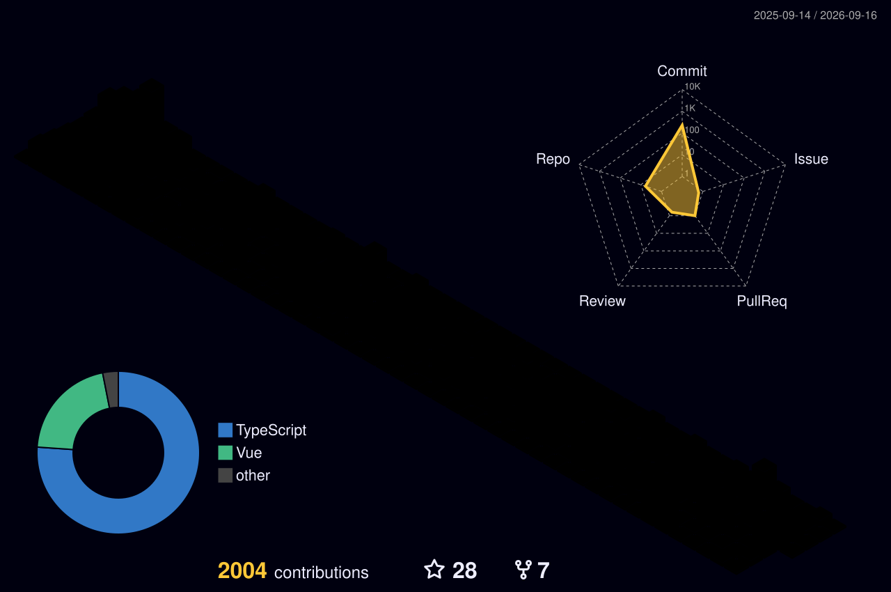

    <h2>Hi there! 👋</h2>

  

My name is Emilyn and I'm from Pará, Brazil.

I'm a **Senior Frontend Engineer** with **6+ years of experience** building scalable web applications, fintech platforms, SaaS products, and digital banking solutions. I specialize in **react, next.js, typescript, javascript, and vue.js**, with a strong focus on frontend architecture, performance, design systems, accessibility, and delivering high-quality user experiences.

- 🎓 Associate Degree in Analysis and Systems Development
- 🎓 Postgraduate Degree in Front-end Development
- 💻 6+ years of professional experience as a Senior Frontend Engineer
- ⚛️ Specialized in react, next.js, typescript, javascript, and vue.js
- 🏦 Experience building fintech, SaaS, and digital banking platforms
- 🧩 Strong background in frontend architecture, reusable component libraries, and scalable applications
- 🧪 Experience with automated testing using jest and cypress
- 🚀 40+ projects delivered
- ☕ 2k+ cups of coffee consumed

---

## :computer: Languages/Frameworks/Libs
  

   

  

  
---

## :bar_chart: Github Infos

|  |  |
| ---------------------------------------------------------------------------------------------------------------------------------------------------------------------------------------------------- | --------------------------------------------------------------------------------------------------------------------------------------------------------------------------------------- |

---

## :trophy: Rewards
 
   

     
  

---

Profile maintained with dedication and 💙 by Emilyn C. Pieritz

