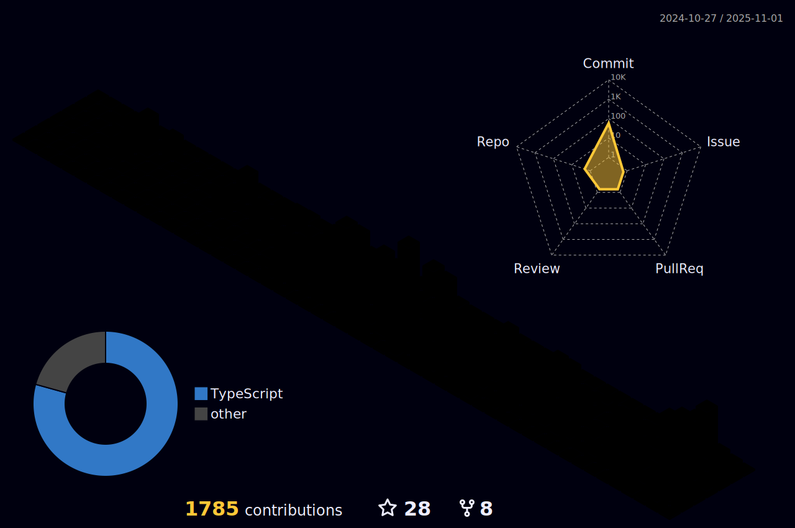

    <h2>👋 Hello World! 🌍</h2>

  

Hi! :v: My name is Emilyn, I'm 34 years old and I live in the state of Pará/Brazil.

I have a professional trajectory of 10 years as a feashion designer and in 2020 I successfully transitioned to front-end development. 

- Associate degree in Analysis and Systems Development at Uniasselvi  
- Postgraduate in Front-end Development at Anhanguera 
- Creation and improvement of websites, systems, e-commerces, and email marketing  
- Responsive development and SEO best practices  
- Experience working with Scrum and Kanban methodologies  
- 5+ years of experience as a Front-end Developer  
- 40+ projects delivered  
- 2k+ cups of coffee consumed ☕  

---

## :computer: Languages/Frameworks/Libs
  

   

  

  
---

## :bar_chart: Github Infos

|  |  |
| ---------------------------------------------------------------------------------------------------------------------------------------------------------------------------------------------------- | --------------------------------------------------------------------------------------------------------------------------------------------------------------------------------------- |

---

## :trophy: Rewards
 
   

     
  

---

Profile maintained with dedication and 💙 by Emilyn C. Pieritz

